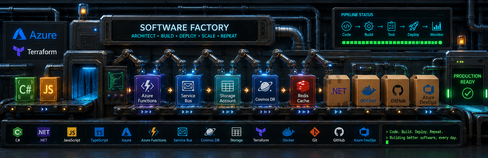

## Summary
I'm a software engineer who enjoys turning ideas into reliable software.

I've been building applications with C# and .NET for over 17 years, and these days you'll usually find me working with Azure, distributed systems, and event-driven architectures.

Most of my work revolves around C#, .NET, Azure and distributed systems, but I'm always exploring new tools, architectures and ideas.

Lately I've been focused on Azure, cloud-native applications, event-driven systems, and building software that can scale without becoming a maintenance nightmare.

<h3>🤝 Let's Connect </h3>
<a href="sergiosantanar">
    
    https://www.linkedin.com/in/sergiosantanar
</a>

## Backend

## Cloud

## Data

## Architecture

## Front-End

